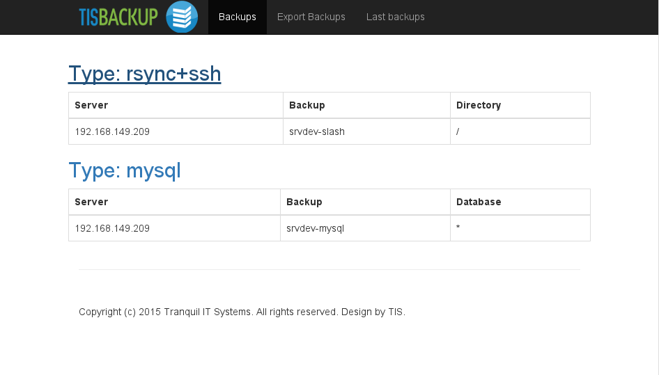
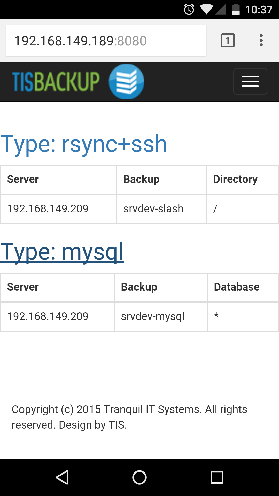

.. Reminder for header structure:
  Level 1: ====================
  Level 2: --------------------
  Level 3: ++++++++++++++++++++
  Level 4: """"""""""""""""""""
  Level 5: ^^^^^^^^^^^^^^^^^^^^

.. meta::
  :description: Screenshots of TISBackup
  :keywords: Documentation, TISBackup, screenshots

.. |clap| image:: wapt-resources/clapping-hands-microsoft.png
  :scale: 50%
  :alt: Clapping hands

Screenshots of TISBackup
========================

.. _tisbackup_screenshots:

  TISBackup Web interface

.. figure:: wapt-resources/tisbackup_hdd_export.png
  :align: center
  :scale: 100%
  :alt: Exporting a backup to an external USB HDD

  Exporting a backup to an external USB HDD

.. figure:: wapt-resources/tisbackup_hdd_export_status.png
  :align: center
  :scale: 100%
  :alt: Status of exported backups

  Status of exported backups

  Overview of current backups

.. figure:: wapt-resources/tisbackup_successful_backups.png
  :align: center
  :scale: 100%
  :alt: Overview of successful backups

  Overview of successful backups

.. figure:: wapt-resources/tisbackup_searching_backups.png
  :align: center
  :scale: 100%
  :alt: Searching for past backups

  Searching for past backups

.. figure:: wapt-resources/tisbackup_action_menu.png
  :align: center
  :scale: 100%
  :alt: TISBackup action menu

  TISBackup action menu
